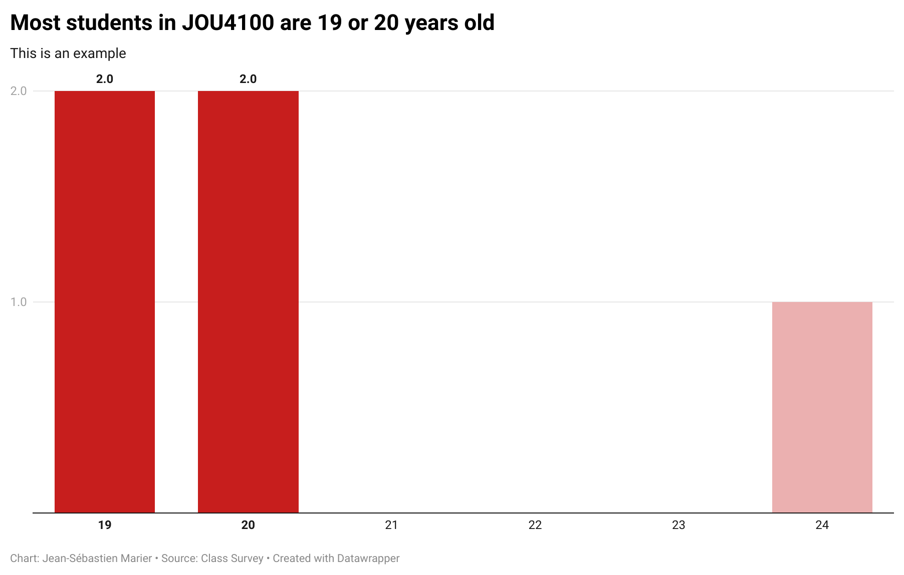

**Date** 
**Course Code & Course Name** 
**Student's First Name & Last Name** 
**Presented to Jean-Sébastien Marier** 

# Project 1: Audit of a Data Visualization

Use one hashtag symbol (`#`) to create a level 1 heading like this one.

## Foreword

For this assignment, you must write a 1000-1500-word audit/critique of a third-party data visualization. It can come from a multimedia news article, a public health dashboard, a company’s annual report, etc. In this short paper, you must clearly state and describe the type/kind of visualization you are talking about. You must also discuss two of its strengths and two shortcomings. Make sure to give concrete examples, and to cite some of the mandatory readings and/or other relevant sources to support your claims. Don’t forget to include relevant screen captures. Your assignment must be written with the Markdown format and submitted on GitHub Classroom.

**Here are some useful resources for this assignment:**

* [GitHub's *Basic writing and formatting syntax* page](https://docs.github.com/en/github/writing-on-github/getting-started-with-writing-and-formatting-on-github/basic-writing-and-formatting-syntax)
* [The template repository for this assignment in case you delete something by mistake](https://github.com/jsmarier/Template-for-the-Audit-of-a-Data-Visualization)

Did you notice how to create a hyperlink? In Markdown, we put the clickable text between square brackets and the actual URL between parentheses.

And to create an unordered list, we simply put a star (`*`) before each item.

## 1. Introduction

Insert text here.

To include a screen capture, use the sample code below. Your images should be saved in the same folder as your `.md` file.

 
*Figure 1: Screen capture of the data visualization.*

## 2. Strengths

Use two hashtag symbols (`##`) to create a level 2 heading like this one.

### 2.1. Strength 1

Use three hashtag symbols (`###`) to create a level 3 heading like this one. Please follow this template when it comes to level 1 and level 2 headings. However, you can use level 3 headings as you see fit.

### 2.2. Strength 2

Support your claims by citing relevant sources. Please follow [APA guidelines for in-text citations](https://apastyle.apa.org/style-grammar-guidelines/citations).

**For example:**

As Cairo (2016) argues, a data visualization should be truthful...

## 3. Weaknesses

### 3.1. Weakness 1

Insert text here.

### 3.1. Weakness 2

Insert text here.

## 4. Conclusion

Thank you for reading my report.

## 5. References

Include a list of your references here. Please follow [APA guidelines for references](https://apastyle.apa.org/style-grammar-guidelines/references). Hanging paragraphs aren't required though.

**Here's an example:**

Bounegru, L., & Gray, J. (Eds.). (2021). *The Data Journalism Handbook 2: Towards A Critical Data Practice*. Amsterdam University Press. [https://ocul-crl.primo.exlibrisgroup.com/permalink/01OCUL_CRL/hgdufh/alma991022890087305153](https://ocul-crl.primo.exlibrisgroup.com/permalink/01OCUL_CRL/hgdufh/alma991022890087305153)
